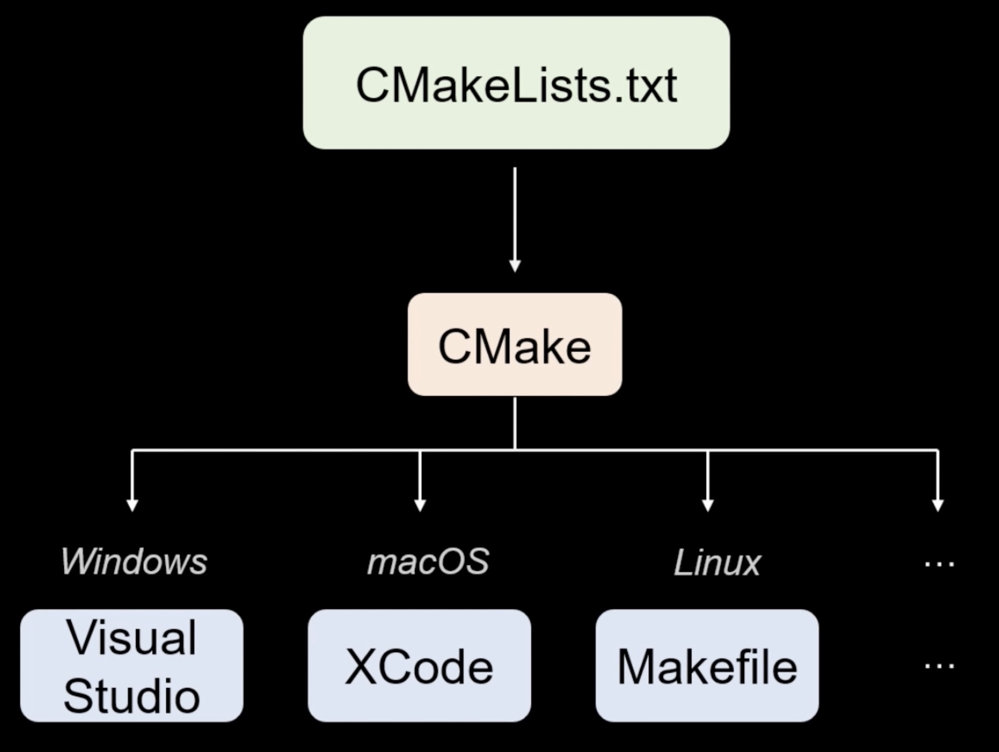

# 编译 C++ 项目必备 CMake

:earth_asia: **Bilibili视频传送门：** [远程开发 C++ 003_CMake](https://www.bilibili.com/video/BV1Zq4y13777?spm_id_from=333.999.0.0) :earth_asia:

本篇文章将和大家聊一聊编译 C++ 项目的必备工具 CMake。现在几乎所有的大型的开源的 C++ 项目，都会使用 CMake 来做构建系统。 

比如编译基础设置 [LLVM](https://github.com/llvm/llvm-project)，高性能异步 IO 库 [libuv](https://github.com/libuv/libuv)，[boost 库](https://github.com/boostorg/boost)，当然还有分布式深度学习框架 [OneFlow](https://github.com/Oneflow-Inc/oneflow)。

### CMake 项目特点

要识别 CMake 项目特别简单，那就是这个项目下一定有名为 CMakeLists.txt 的文件


本文的结构如下：

- 为什么需要 CMake
- CMake 示例
- 实战编译 OneFlow


## 为什么需要 CMake

简单而言，CMake 可以帮助跨平台来编译工程。

比如说大家在 Windoes 上可能会使用 Visual Studio，在 Mac 上可能会使用 XCode，在 Linux 系统下会使用 Makefile 来编译一个 C++ 工程。如果同一套 C++ 代码在不同的构建系统下，都需要重新去设置一遍，是非常不方便的。

而 CMake 它就可以解决这类问题，CMake 通过读取 CMakeLists.txt 的配置文件，来根据当前的平台构建相应的 C++ 工程。




## CMake 示例

这里是一个简单的 CMake 的例子：

```Text
cmake_minimum_required(VERSIOIN 3.14)  #设置CMake最小版本 
project (cmake_example)  #设置工程名
add_executable(cmake_example main.cop ui.cpp logic.cpp)  #生成可执行文件
```

这个 CMakeLists 是项目设置的一个配置文件，第一行是设置 CMake 的最小版本，第二行是设置工程名，大家根据自己的喜好设置就行，第三行是生成的可执行文件名，后面的是依赖的 cpp 名。

接下来文章将向大家展示在 Linux 和 Windows 系统下使用 CMake 来生成不同的工程。

### Linux 下使用 CMake

首先，需要创建一个 build 目录，在 terminal 输入 `mkdir build`，目的是为了将 CMake 后生成的所有文件，所有内容都放到这个 build 目录下。

然后切换到 build 目录，terminal 输入 `cd build`。

接着使用 CMake 命令，后面接 CMakeLists 所在的目录，也就是它的上一级目录加两个点 `cmake ..`。

然后在 build 目录下就生成了 MakeFile，接着 make 一下，输入 `make`。可以发现在 build 目录下就生成了 cmake_example 这个可执行的文件。

接着执行一下，输入 `./cmake_example`，就可以打印出要的结果。

CMake 其实就是通过读取 CMakelists.txt 来生成对应工程的，也可以在 CMake 时传递一些变量值来设置工程属性，比如刚刚编译的工程，它是一个 Release 版本的，是没有调试信息的。

关于 CMake 更多知识点，可以使用 man 命令来查看一下，`man cmake`。

### Windows 下使用 CMake

首先打开 VS 的交叉编译工具，切换到工程目录下，`cd D:\tmp_code\cmake_example`。

输入 `dir`，然后使用 `mkdir build` 命令，创建 build 目录。

使用 `cd build` 切换到 build 目录。

然后使用 CMake 命令 `cmake ..`，就可以在 build 目录下就生成一个 sln 文件。


## 实战编译 OneFlow

像 OneFlow 这样大型的系统，它的 CMake 配置文件往往是非常复杂的，想要看懂里面的源码，了解如何配置，往往是不太容易的。

但是这样的项目，它的 Readme 一般都会附上说明，仔细看 Readme 就行了。 

OneFlow 的 Readme 文件，它描述了该去哪里找怎么编译 OneFlow。

点开这个[链接](https://github.com/Oneflow-Inc/conda-env)，然后一步一步地编译 OneFlow。

编译 OneFlow 需要使用到 conda，具体怎么安装，在上一篇文章 [Conda](../remote_cpp_development/conda.md) 中。

首先，需要构建编译环境：

使用 `git clone https://github.com/Oneflow-Inc/conda-env.git` 下载这一个编译环境包。

输入 `cd conda-env` 来 cd 到这个环境包。

输入 `conda env create -f=dev/gcc7/environment-v2.yml` 构建这一个环境

最重要的一步，输入 `conda activate oneflow-dev-gcc7-v2` 和 `conda env config vars set CXXFLAGS="-fPIC"` 激活使用这个环境。

在成功激活这个环境后，就可以切换到 OneFlow 源码目录下，依次输入 `cd..`， `ls` 和 `cd oneflow/`。

接着，使用 CMake 来构建 OneFlow：

输入 `mkdir build` 来构建一个 build 目录，目的将生成的所有内容都放到 build 目录下。

然后切换到 build 目录下，`cd build`。

使用 CMake 指令 `cmake .. -C ../cmake/caches/cn/cuda.cmake \ -DCUDA_TOOLKIT_ROOT_DIR=/usr/local/cuda \ -DCUDNN_ROOT_DIR=/usr/local/cudnn` 进行构建。

然后就会发现当前的 build 目录下生成了 MakeFile。

接着就可以使用 `make -j$(nproc)` 来生成可执行文件了，第一次编译的话可能需要半个小时左右。

先输入 `cd ..` 切换到上级目录，再接着使用 `source build/source.sh` 将 OneFlow 添加到 Python 的 path 中。

最后，可以使用指令 `python3 -m oneflow --doctor` 来检查是否编译成功。


